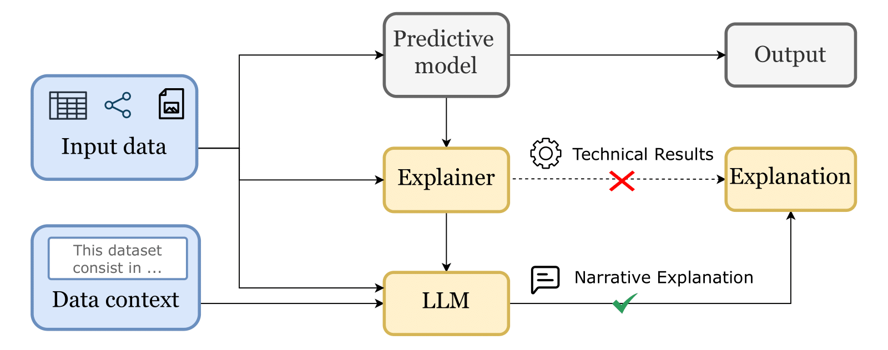

# Awesome Narrative Explainable AI
We present a curated collection of research and resources on Narrative Explainable AI (Narrative XAI), highlighting approaches that bridge Large Language Models (LLMs) and Explainable AI (XAI) to create user-centric and intuitively understandable explanations.

**Source**: [Large Language Models for Narrative Explainable AI: A Survey](https://hercolelab.netlify.app)

We will keep focusing on this field and updating relevant information 💡 🔄 🧠

Contributions to our repository are welcome! Feel free to [pull requests](https://github.com/hercolelab/awesome-narrative-explainable-AI/pulls).

## Overview of the Narrative XAI pipeline

## Table of contents
