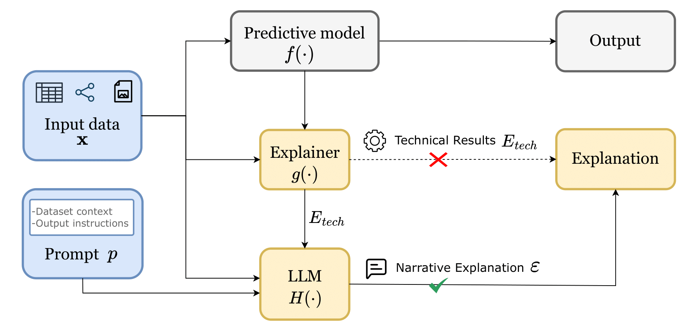

# Awesome Narrative Explainable AI
We present a curated collection of research and resources on **Narrative Explainable AI (Narrative XAI)**, highlighting approaches that bridge **Large Language Models (LLMs)** and **Explainable AI (XAI)** to create user-centric and intuitively understandable explanations.

**Source**: [Large Language Models for Narrative Explainable AI: A Survey](https://hercolelab.netlify.app)

We will keep focusing on this field and updating relevant information 💡 🔄 🧠

Contributions to our repository are welcome! Feel free to [pull requests](https://github.com/hercolelab/awesome-narrative-explainable-AI/pulls).

## Narrative XAI Pipeline

  <em>Figure 1. Illustration of the Narrative XAI pipeline.</em>
  
   

A predictive model processes input data to generate an output. Traditional explainers often provide only technical or low-level interpretations (red ✗). By incorporating contextual information and leveraging a large language model (LLM), the system delivers clearer, user-oriented explanations (green ✓), making model outcomes easier to understand.

---
## Table of contents
- [Awesome Narrative Explainable AI](#awesome-narrative-explainable-ai)
  - [Overview of the Narrative XAI pipeline](#narrative-xai-pipeline)
  - [Table of Contents](#table-of-contents)
- [Narrative Explainable AI with large Language Models](#narrative-explainable-ai-with-large-language-models)
  - [Tabular Data](#tabular-data)
  - [Graph Data](#graph-data)
  - [Images](#images)
  - [Reinforcement Learning Policies](#reinforcement-learning-policies)
  - [Evaluation Metrics](#evaluation-metrics)
- [Datasets](#datasets)
- [Citation](#citation)

---

# Narrative Explainable AI with large Language Models
We distinguish contributions that focus on tabular data, graph-structured data, image data (Section 5.3), and reinforcement-learning policies, as these modalities entail distinct representational challenges, explanation requirements, and
narrative strategies. All these works are summarised below.

## Tabular Data
- Explingo: Explaining AI Predictions using Large Language Models [[Paper]](https://arxiv.org/pdf/2412.05145) [[Code]](https://github.com/sibyl-dev/Explingo)
- Enhancing the Interpretability of SHAP Values Using Large Language Models [[Paper]](https://arxiv.org/pdf/2409.00079)
- Augmenting XAI with LLMs: A Case Study in Banking Marketing Recommendation [[Paper]](https://www.researchgate.net/publication/382119664_Augmenting_XAI_with_LLMs_A_Case_Study_in_Banking_Marketing_Recommendation)
- Natural Language Explanations for Machine Learning Classification Decisions [[Paper]](https://ieeexplore.ieee.org/document/10191637) [[Code]](https://github.com/jameswburton18/LocalLevelExplanations)
- iLLuMinaTE: An LLM-XAI Framework Leveraging Social Science Explanation Theories Towards Actionable Student Performance Feedback [[Paper]](https://ojs.aaai.org/index.php/AAAI/article/view/35065) [[Code]](https://github.com/epfl-ml4ed/iLLuMinaTE)
- Using LLMs for Explaining Sets of Counterfactual Examples to Final Users [[Paper]](https://arxiv.org/pdf/2408.15133) [[Code]](https://github.com/arturofredes/LLM-4-CFs-Explanation)
- Enhancing XAI Narratives through Multi-Narrative Refinement and Knowledge Distillation [[Paper]](https://arxiv.org/pdf/2510.03134) [[Code]](https://github.com/flaat/llm_kd) 
- "Show Me How": Benefits and Challenges of Agent-Augmented Counterfactual Explanations for Non-Expert Users [[Paper]](https://dl.acm.org/doi/full/10.1145/3699682.3728321)
- IMPACT: an interactive multi-disease prevention and counterfactual treatment system using explainable AI and a multimodal LLM [[Paper]](https://peerj.com/articles/cs-2839/) [[Code]](https://github.com/iprasantmohanty/presonalized-health)

## Graph Data
- Natural Language Counterfactual Explanations For Graphs Using Large Language Models [[Paper]](https://arxiv.org/pdf/2410.09295) [[Code]](https://github.com/flaat/llm-graph-cf)
- GraphXAIN: Narratives to Explain Graph Neural Networks [[Paper]](https://arxiv.org/pdf/2411.02540) [[Code]](https://github.com/ADMAntwerp/GraphXAIN)
- GraphNarrator: Generating Textual Explanations for Graph Neural Networks [[Paper]](https://arxiv.org/pdf/2410.15268)
- Rule2Text: Natural Language Explanation of Logical Rules in Knowledge Graphs [[Paper]](https://arxiv.org/pdf/2507.23740) [[Code]](https://github.com/idirlab/KGRule2NL)
- Explaining Graph Neural Networks with Large Language Models: A Counterfactual Perspective for Molecular Property Prediction [[Paper]](https://arxiv.org/pdf/2410.15165) [[Code]](https://github.com/YinhanHe123/new_LLM4GNNExplanation)

## Images
list
## Reinforcement Learning Policies
list
## Evaluation Metrics
list

# Datasets
table

# Citation
bibtex

